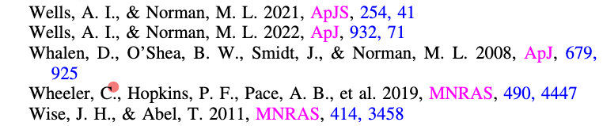
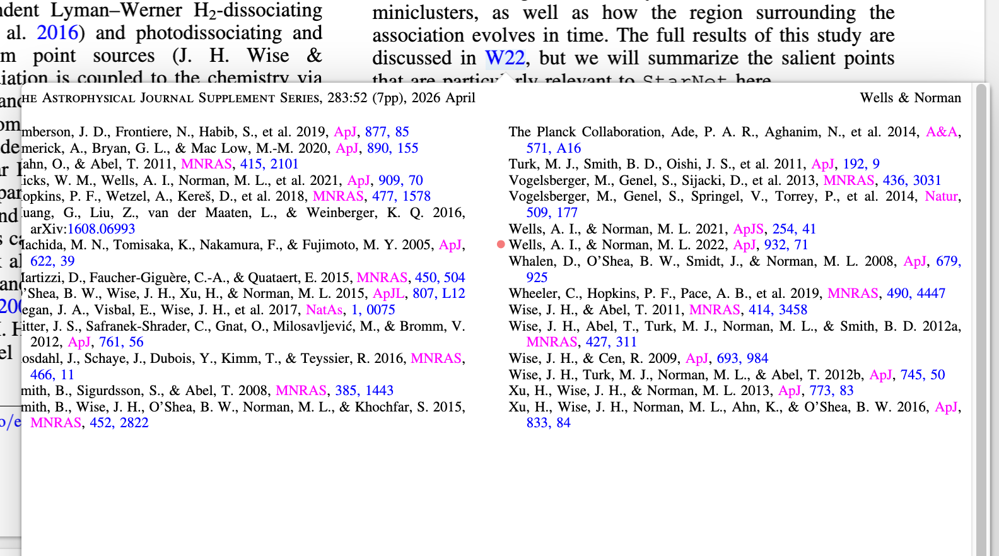

# Reference Marker Fix

English | [简体中文](README.zh-CN.md)

A temporary community plugin for **Zotero** that corrects misplaced reference markers in citation hover popups and aligns them with the target reference's first line.

[Download the latest release](https://github.com/Suwueng/zotero-reference-marker-fix/releases/latest)

## Before and after

**Before**

**After**

## Features

- Corrects the marker offset caused by trimming the page margins.
- Places the dot to the left of the reference's first line, centered on the visible letter body rather than the font box or punctuation tails.
- Preserves the full-page popup and falls back to the native renderer if the replacement fails.
- Restores the original method when disabled.

## Installation

1. Download the `.xpi` file from [Releases](https://github.com/Suwueng/zotero-reference-marker-fix/releases/latest). The automatically generated Source code archives are not installable plugins.
2. In Zotero, open **Tools → Plugins → gear → Install Plugin From File**.
3. Select the `.xpi` file and restart Zotero after installation.

## Compatibility and removal

- Tested on **Zotero 10.0.5 for macOS**. The current package restricts installation and activation to 10.0.5; compatibility with other versions, Windows and Linux has not been verified.
- This temporary community workaround uses private reader APIs. Disable it once an official fix is available.
- Alignment uses a local geometric heuristic. Multi-line references align to the first line. Unrecognized text, rotated pages and unsupported layouts retain the corrected destination anchor.
- The plugin does not modify PDFs, annotations, the library database or Zotero's program files. Preview processing is local; Zotero's plugin updater accesses the GitHub update manifest.
- To remove the workaround, disable or uninstall it in the plugin manager and restart Zotero.

## Reporting issues

Open an [issue](https://github.com/Suwueng/zotero-reference-marker-fix/issues) with your Zotero version, operating system, plugin version, citation location and a publicly accessible example PDF link or DOI. Screenshots should show the relationship between the citation and its target reference.

## Background

Zotero's internal-link preview trims the page margins before drawing the destination marker. In the affected implementation, the dot coordinates are not translated to the cropped canvas, so the marker shifts down and to the right.

- [Earlier report: Highlights of cited paper on consistently wrong place](https://forums.zotero.org/discussion/118062/highlights-of-cited-paper-on-consistently-wrong-place) — similar symptoms; the cause of that earlier report has not been confirmed.
- [Technical diagnosis](docs/diagnosis.md) — crop-coordinate bug and the separate visual-alignment enhancement.

## Contributions

This plugin was developed by Suwueng with assistance from OpenAI’s Codex. Codex assisted with investigating the coordinate mismatch, implementing the temporary fix and visual alignment, writing and running tests, and preparing the release. Suwueng reported the issue, guided the behavior and naming, tested the plugin in daily Zotero use, and confirmed the final visual result.

## License and attribution

[GNU Affero General Public License v3](COPYING). The preview-rendering method is adapted from [Zotero Reader](https://github.com/zotero/reader), copyright Corporation for Digital Scholarship. Local modifications correct the dot coordinates, add visual alignment and provide plugin lifecycle handling. See the included upstream copyright and license text.
